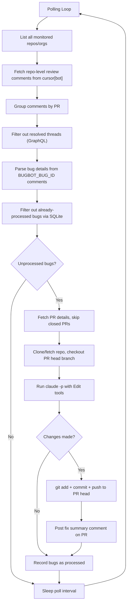

# Claude Code Bugbot Autofix

Automatically fix [Cursor Bugbot](https://cursor.com/dashboard?tab=bugbot)-reported bugs using [Claude Code](https://docs.anthropic.com/en/docs/claude-code).

Monitors open pull requests for Cursor Bugbot review comments, parses bug reports, generates fixes via `claude -p`, and commits them directly to the PR head branch. A cost-effective alternative to Cursor's built-in Autofix.

## Features

- **Cursor Bugbot monitoring**: Polls GitHub for `cursor[bot]` review comments using repo-level API for efficient scanning
- **Resolved thread filtering**: Skips bugs whose review threads have been resolved (via GraphQL API)
- **Automatic bug parsing**: Extracts title, severity, description, file path, and line numbers from Bugbot's structured comment format
- **Claude Code fix generation**: Runs `claude -p` with Edit tools to fix detected bugs in cloned repositories
- **Direct commit to PR**: Pushes fixes directly to the PR head branch (no separate fix branch or approval workflow)
- **Duplicate prevention**: SQLite-based state tracking ensures each bug ID is processed only once
- **Single-instance lock**: File-based lock prevents multiple daemon instances from running concurrently
- **Fix summary comments**: Posts a summary comment on the PR listing all fixed issues with commit link
- **Organization-wide monitoring**: Scans all repos under configured GitHub organizations
- **Docker support**: Production-ready Dockerfile and docker-compose.yml

## Prerequisites

- **`gh` CLI**: Authenticated with GitHub (`gh auth status`)
- **`claude` CLI**: Authenticated Claude Code (`claude --version`)
- **`git`**: For repository operations
- **Node.js** >= 18.0.0 (for local installation) or **Docker** (for containerized deployment)

## Authentication Setup

### GitHub Authentication

#### Linux Environment

- For local usage, run `gh auth login` to authenticate with GitHub
- Alternatively, you can set the environment variable `GH_TOKEN`
- The gh CLI will automatically manage authentication tokens

#### macOS Environment

- For local usage, run `gh auth login` to authenticate with GitHub
- When using Docker containers, you need to set `GH_TOKEN` in `.env`
- The token can be obtained by running `gh auth token` command
- Note: macOS Keychain is inaccessible from containers, so environment variables are required

#### Docker Environment

- For Linux-based Docker containers, authentication is auto-mounted via `docker-compose.yml` volume (`~/.config/gh:/root/.config/gh:ro`)
- For macOS Docker containers, you must set `GH_TOKEN` in `.env`
- The GH_TOKEN can be obtained by running `gh auth token`

To obtain `GH_TOKEN`:

```bash
gh auth token
```

### Claude Code Authentication

#### Option 1: OAuth Token (`CLAUDE_CODE_OAUTH_TOKEN`) -- for Pro/Max/Team plan

```bash
claude setup-token
```

#### Linux Environment

- For local usage, run `claude login` to authenticate with Claude Code
- Credentials are stored in `~/.claude/.credentials.json`
- For Docker containers on Linux, authentication is auto-mounted via `docker-compose.yml` volume (`~/.claude:/root/.claude`)

#### macOS Environment

- For local usage, run `claude login` to authenticate with Claude Code
- Credentials are stored in the macOS Keychain after `claude login`
- For Docker containers on macOS, you must set `CLAUDE_CODE_OAUTH_TOKEN` in `.env`
- The OAuth token can be generated by running `claude setup-token` command

#### Docker Environment

- For Linux-based Docker containers, authentication is auto-mounted via `docker-compose.yml` volume (`~/.claude:/root/.claude`)
- For macOS Docker containers, you must set `CLAUDE_CODE_OAUTH_TOKEN` in `.env`
- The OAuth token can be generated by running `claude setup-token` command

#### Option 2: API Key (`ANTHROPIC_API_KEY`) -- for pay-as-you-go billing

1. Create an API key at [console.anthropic.com](https://console.anthropic.com/)
2. Set `ANTHROPIC_API_KEY` in `.env`

## Quick Start

### Local Installation

```bash
git clone https://github.com/Senna46/claude-code-bugbot-autofix.git
cd claude-code-bugbot-autofix

npm install

cp .env.example .env
# Edit .env: set AUTOFIX_GITHUB_ORGS or AUTOFIX_GITHUB_REPOS

npm run build
npm start

# Or run in development mode
npm run dev
```

### Automated Setup

You can also use the automated setup script to configure your environment:

```bash
./setup-config.sh
```

### Docker

#### Linux Environment

```bash
git clone https://github.com/Senna46/claude-code-bugbot-autofix.git
cd claude-code-bugbot-autofix

cp .env.example .env
# Edit .env with your settings

# Prevent Docker from creating ~/.claude.json as a directory
touch ~/.claude.json

docker compose build
docker compose up -d

# View logs
docker compose logs -f
```

#### macOS Environment

```bash
git clone https://github.com/Senna46/claude-code-bugbot-autofix.git
cd claude-code-bugbot-autofix

cp .env.example .env
# Edit .env with your settings

# Prevent Docker from creating ~/.claude.json as a directory
touch ~/.claude.json

# macOS only: add auth tokens to .env
# gh auth token            -> set GH_TOKEN
# claude setup-token       -> set CLAUDE_CODE_OAUTH_TOKEN

docker compose build
docker compose up -d

# View logs
docker compose logs -f
```

## Configuration

Copy `.env.example` to `.env` and configure:

### Target Repositories

| Variable               | Required | Default | Description                                               |
| ---------------------- | -------- | ------- | --------------------------------------------------------- |
| `AUTOFIX_GITHUB_ORGS`  | Yes\*    | --      | GitHub owners to monitor: users or orgs (comma-separated) |
| `AUTOFIX_GITHUB_REPOS` | Yes\*    | --      | Specific repos to monitor (`owner/repo`, comma-separated) |

\* At least one of `AUTOFIX_GITHUB_ORGS` or `AUTOFIX_GITHUB_REPOS` must be set.

### Behavior

| Variable                | Required | Default                      | Description                        |
| ----------------------- | -------- | ---------------------------- | ---------------------------------- |
| `AUTOFIX_POLL_INTERVAL` | No       | `120`                        | Polling interval in seconds        |
| `AUTOFIX_WORK_DIR`      | No       | `~/.bugbot-autofix/repos`    | Directory for cloning repositories |
| `AUTOFIX_DB_PATH`       | No       | `~/.bugbot-autofix/state.db` | SQLite database path               |
| `AUTOFIX_CLAUDE_MODEL`  | No       | CLI default                  | Claude model to use                |
| `AUTOFIX_LOG_LEVEL`     | No       | `info`                       | Log level (debug/info/warn/error)  |

### Authentication (Docker / Environment Variables)

| Variable                  | Required          | Description                                 |
| ------------------------- | ----------------- | ------------------------------------------- |
| `GH_TOKEN`                | macOS Docker only | GitHub token (`gh auth token`)              |
| `CLAUDE_CODE_OAUTH_TOKEN` | macOS Docker only | Claude OAuth token (`claude setup-token`)   |
| `ANTHROPIC_API_KEY`       | Alternative       | Anthropic API key for pay-as-you-go billing |

## Architecture



### Module Overview

| Module             | Responsibility                                                             |
| ------------------ | -------------------------------------------------------------------------- |
| `main.ts`          | `AutofixDaemon` polling loop, graceful shutdown, single-instance lock      |
| `config.ts`        | Loads and validates `AUTOFIX_*` environment variables                      |
| `bugbotMonitor.ts` | Efficient repo-level scanning, resolved thread filtering, bug discovery    |
| `bugParser.ts`     | Parses `cursor[bot]` comment bodies into structured `BugbotBug` objects    |
| `fixGenerator.ts`  | Clones repos, runs `claude -p`, commits and pushes fixes                   |
| `githubClient.ts`  | Octokit wrapper: repo-level comments, GraphQL resolved threads, PR details |
| `state.ts`         | SQLite tracking of processed bug IDs to prevent duplicates                 |
| `types.ts`         | Shared TypeScript interfaces                                               |
| `logger.ts`        | Structured logging with configurable levels                                |

## Running as a Service

### Docker (recommended)

```bash
docker compose up -d
```

Management commands:

```bash
docker compose ps          # Check status
docker compose logs -f     # View logs
docker compose restart     # Restart
docker compose down        # Stop
docker compose down -v     # Remove with data
```

### macOS (launchd)

Build the project first:

```bash
npm run build
```

Create `~/Library/LaunchAgents/com.bugbot-autofix.plist`:

```xml
<?xml version="1.0" encoding="UTF-8"?>
<!DOCTYPE plist PUBLIC "-//Apple//DTD PLIST 1.0//EN"
  "http://www.apple.com/DTDs/PropertyList-1.0.dtd">
<plist version="1.0">
<dict>
  <key>Label</key>
  <string>com.bugbot-autofix</string>

  <key>ProgramArguments</key>
  <array>
    <string>/path/to/node</string>
    <string>dist/main.js</string>
  </array>

  <key>WorkingDirectory</key>
  <string>/path/to/claude-code-bugbot-autofix</string>

  <key>EnvironmentVariables</key>
  <dict>
    <key>PATH</key>
    <string>/path/to/node/bin:/usr/local/bin:/usr/bin:/bin</string>
    <key>HOME</key>
    <string>/Users/yourname</string>
  </dict>

  <key>RunAtLoad</key>
  <true/>
  <key>KeepAlive</key>
  <true/>

  <key>StandardOutPath</key>
  <string>/path/to/claude-code-bugbot-autofix/logs/stdout.log</string>
  <key>StandardErrorPath</key>
  <string>/path/to/claude-code-bugbot-autofix/logs/stderr.log</string>
</dict>
</plist>
```

Replace `/path/to/node` with the output of `which node`, and update paths accordingly.

```bash
# Load (start) the daemon
launchctl load -w ~/Library/LaunchAgents/com.bugbot-autofix.plist

# Unload (stop) the daemon
launchctl unload ~/Library/LaunchAgents/com.bugbot-autofix.plist

# Check status
launchctl list | grep bugbot

# View logs
tail -f logs/stdout.log
tail -f logs/stderr.log
```

Alternatively, run directly with `nohup`:

```bash
nohup node dist/main.js >> logs/stdout.log 2>> logs/stderr.log &
```

## Related Projects

- [Claude Code BugHunter](https://github.com/Senna46/claude-code-bughunter) -- Self-hosted PR bug detection agent (detection + fix)

## License

MIT
